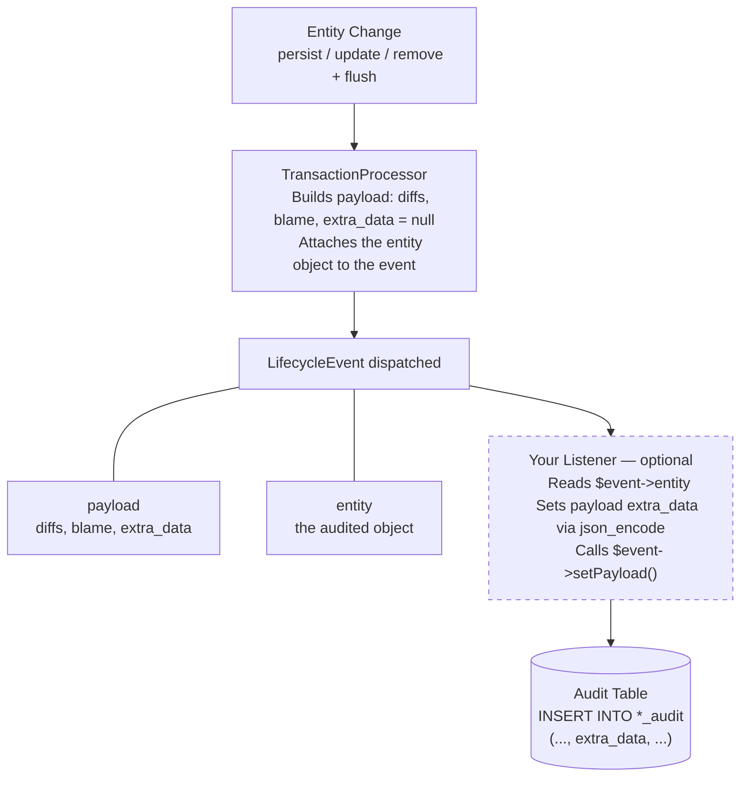

# Extra Data

The `extra_data` column allows you to store arbitrary supplementary information alongside each audit entry. This is useful for capturing contextual data that isn't part of the entity's fields, such as department, role, request metadata, or any business-specific information.

## How It Works

Each audit entry has a nullable JSON `extra_data` column. By default, it is `NULL` (zero overhead when not used). To populate it, you create an event listener on `LifecycleEvent` that sets the `extra_data` key in the payload before the entry is persisted.

### Data Flow



## Setting Up a Listener

Create an event listener that listens to `LifecycleEvent`. The event provides access to both the payload and the original entity object.

```php
<?php

namespace App\EventListener;

use App\Entity\User;
use DH\Auditor\Event\LifecycleEvent;
use Symfony\Component\EventDispatcher\Attribute\AsEventListener;

#[AsEventListener(event: LifecycleEvent::class, priority: 10)]
final class AuditExtraDataListener
{
    public function __invoke(LifecycleEvent $event): void
    {
        $payload = $event->getPayload();

        // Filter by entity class
        if ($payload['entity'] !== User::class || null === $event->entity) {
            return;
        }

        // Attach extra data as a JSON string
        $payload['extra_data'] = json_encode([
            'department' => $event->entity->getDepartment(),
            'role' => $event->entity->getRole(),
        ], JSON_THROW_ON_ERROR);

        $event->setPayload($payload);
    }
}
```

### With Service Injection

Since the listener is a standard Symfony service, you can inject any dependency:

```php
<?php

namespace App\EventListener;

use App\Entity\Order;
use DH\Auditor\Event\LifecycleEvent;
use Symfony\Bundle\SecurityBundle\Security;
use Symfony\Component\EventDispatcher\Attribute\AsEventListener;
use Symfony\Component\HttpFoundation\RequestStack;

#[AsEventListener(event: LifecycleEvent::class, priority: 10)]
final class OrderAuditExtraDataListener
{
    public function __construct(
        private readonly Security $security,
        private readonly RequestStack $requestStack,
    ) {}

    public function __invoke(LifecycleEvent $event): void
    {
        $payload = $event->getPayload();

        if ($payload['entity'] !== Order::class) {
            return;
        }

        $request = $this->requestStack->getCurrentRequest();

        $payload['extra_data'] = json_encode([
            'admin_user' => $this->security->getUser()?->getUserIdentifier(),
            'route' => $request?->attributes->get('_route'),
            'reason' => $request?->headers->get('X-Audit-Reason'),
        ], JSON_THROW_ON_ERROR);

        $event->setPayload($payload);
    }
}
```

## Reading Extra Data

The `Entry` model provides access via the `extraData` property or the `getExtraData()` method:

```php
$reader = new Reader($provider);
$entries = $reader->createQuery(User::class)->execute();

foreach ($entries as $entry) {
    $extraData = $entry->extraData; // ?array (decoded JSON)

    if (null !== $extraData) {
        echo sprintf(
            "Department: %s, Role: %s\n",
            $extraData['department'] ?? 'N/A',
            $extraData['role'] ?? 'N/A',
        );
    }
}
```

Both `$entry->extraData` and `$entry->getExtraData()` return:

- `null` if no extra data was set
- An associative array (decoded from JSON) otherwise

## Schema Update

The `extra_data` column is added automatically when you run the schema update command:

```bash
# Preview the SQL that will be executed
php bin/console audit:schema:update --dump-sql

# Apply the change
php bin/console audit:schema:update --force
```

> [!TIP]
> No manual migration is needed. The column uses the same JSON type as `diffs` (with automatic TEXT fallback on platforms that don't support native JSON).

## Important Caveats

### Entity State in `remove()` Operations

> [!WARNING]
> During a `remove` operation, the entity object is still in memory but has been **detached from the Unit of Work**.
>
> - Direct property access works (e.g., `$entity->getName()`)
> - **Lazy-loaded associations may not be accessible** (they will throw or return `null`)
>
> If you need association data during deletions, ensure those associations are eagerly loaded or fetch the data before the flush.

### Do Not Write to the Audited EntityManager

> [!CAUTION]
> The `LifecycleEvent` is dispatched **during** a flush. The listener executes synchronously between `notify()` and `persist()`, within the same database transaction.
>
> - **SELECTs are safe** (reading from another entity manager or connection)
> - **INSERT/UPDATE/DELETE on the audited EntityManager will interfere** with the ongoing flush and may cause unexpected behavior
>
> If you need to perform write operations based on audit data, defer them (e.g., using a Symfony Messenger message).

### Payload Validation

> [!IMPORTANT]
> The `extra_data` key is **required** in the payload. If you have custom code that builds payloads manually via `AuditEvent::setPayload()`, you must include the `extra_data` key (set it to `null` if you don't need it):
>
> ```php
> $payload['extra_data'] = null; // Required, even if unused
> $event->setPayload($payload);
> ```

### JSON Encoding

> [!WARNING]
> The `extra_data` value in the payload must be either `null` or a **JSON-encoded string** (not an array). Always use `json_encode()` when setting it:
>
> ```php
> // Correct
> $payload['extra_data'] = json_encode(['key' => 'value'], JSON_THROW_ON_ERROR);
>
> // Incorrect - will not be stored properly
> $payload['extra_data'] = ['key' => 'value'];
> ```

### Performance

| Aspect | Impact |
|--------|--------|
| Write | Negligible (+1 column in INSERT) |
| Read | Negligible (+1 column in SELECT, lazy decoding) |
| Storage | `NULL` when no listener is active (zero overhead) |

### Filtering by Extra Data

> [!NOTE]
> Querying/filtering by `extra_data` content is not built-in. Users on PostgreSQL or MySQL 8+ can add GIN or functional indexes manually for specific JSON paths. You can also create a custom `FilterInterface` implementation.

## Next Steps

- [Entry Model Reference](querying/entry.md)
- [Querying Overview](querying/index.md)
- [Upgrade Guide](upgrade/v4.md)
