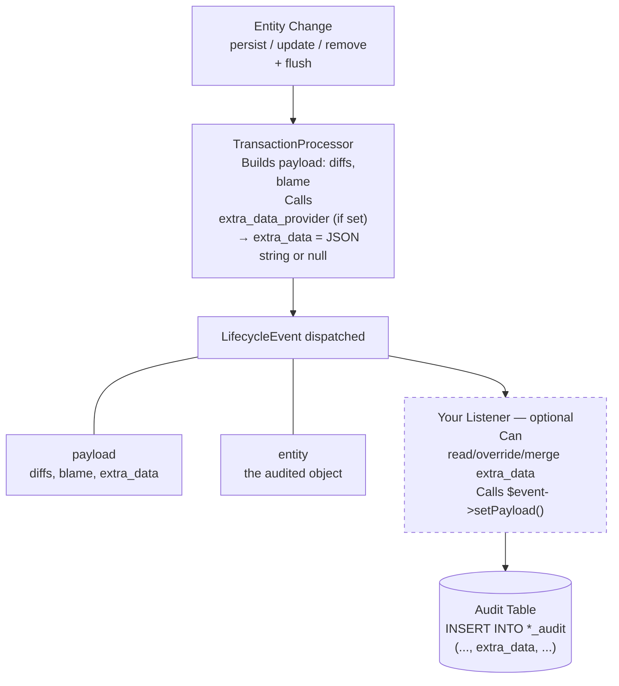

# Extra Data

The `extra_data` column allows you to store arbitrary supplementary information alongside each audit entry. This is useful for capturing contextual data that isn't part of the entity's fields, such as department, role, request metadata, or any business-specific information.

## How It Works

Each audit entry has a nullable JSON `extra_data` column. By default, it is `NULL` (zero overhead when not used).

There are two complementary ways to populate it — you can use either or both:

1. **`extra_data_provider` callable** (global): configured once on `Configuration`, automatically applied to every audit entry. Ideal for request-level context such as the current route name, request ID, or tenant identifier.
2. **`LifecycleEvent` listener** (per-entity): an event listener that intercepts each audit entry just before it is persisted and sets (or enriches) `extra_data` based on the entity class or its properties.

### Data Flow



> [!NOTE]
> When both a provider and a listener are configured, the listener **takes precedence** because it fires after the provider. You can use the listener to enrich or override data set by the provider.

---

## Approach 1: `extra_data_provider` Callable

Register a callable on the `Configuration` object. It is invoked for every audit entry in every transaction. The callable must return `?array` — return `null` to leave `extra_data` empty.

```php
$auditor->getConfiguration()->setExtraDataProvider(
    static fn (): ?array => ['route' => 'app_order_edit', 'env' => 'prod']
);
```

The returned array is automatically JSON-encoded and stored in `extra_data`. If the callable returns `null`, `extra_data` is stored as `NULL`.

### When to use this approach

| Use case | Suitable? |
|----------|-----------|
| Capture the current route name for every entry | ✅ |
| Attach a request ID / correlation ID | ✅ |
| Attach tenant / organisation context | ✅ |
| Attach entity-specific data (e.g. `$entity->getDepartment()`) | ❌ Use a listener instead |

---

## Approach 2: `LifecycleEvent` Listener

Create an event listener that listens to `LifecycleEvent`. The event provides access to both the payload and the original entity object.

```php
<?php

namespace App\EventListener;

use App\Entity\User;
use DH\Auditor\Event\LifecycleEvent;
use Symfony\Component\EventDispatcher\Attribute\AsEventListener;

#[AsEventListener(event: LifecycleEvent::class, priority: 10)]
final class AuditExtraDataListener
{
    public function __invoke(LifecycleEvent $event): void
    {
        $payload = $event->getPayload();

        // Filter by entity class
        if ($payload['entity'] !== User::class || null === $event->entity) {
            return;
        }

        // Attach extra data as a JSON string
        $payload['extra_data'] = json_encode([
            'department' => $event->entity->getDepartment(),
            'role' => $event->entity->getRole(),
        ], JSON_THROW_ON_ERROR);

        $event->setPayload($payload);
    }
}
```

### With Service Injection

Since the listener is a standard Symfony service, you can inject any dependency:

```php
<?php

namespace App\EventListener;

use App\Entity\Order;
use DH\Auditor\Event\LifecycleEvent;
use Symfony\Bundle\SecurityBundle\Security;
use Symfony\Component\EventDispatcher\Attribute\AsEventListener;
use Symfony\Component\HttpFoundation\RequestStack;

#[AsEventListener(event: LifecycleEvent::class, priority: 10)]
final class OrderAuditExtraDataListener
{
    public function __construct(
        private readonly Security $security,
        private readonly RequestStack $requestStack,
    ) {}

    public function __invoke(LifecycleEvent $event): void
    {
        $payload = $event->getPayload();

        if ($payload['entity'] !== Order::class) {
            return;
        }

        $request = $this->requestStack->getCurrentRequest();

        $payload['extra_data'] = json_encode([
            'admin_user' => $this->security->getUser()?->getUserIdentifier(),
            'route' => $request?->attributes->get('_route'),
            'reason' => $request?->headers->get('X-Audit-Reason'),
        ], JSON_THROW_ON_ERROR);

        $event->setPayload($payload);
    }
}
```

### Merging Provider and Listener Data

When both a provider and a listener are active, you can merge their contributions in the listener:

```php
public function __invoke(LifecycleEvent $event): void
{
    $payload = $event->getPayload();

    if ($payload['entity'] !== User::class) {
        return;
    }

    // Decode what the provider already set (if anything)
    $existing = null !== $payload['extra_data']
        ? json_decode($payload['extra_data'], true, 512, JSON_THROW_ON_ERROR)
        : [];

    // Merge entity-specific data
    $merged = array_merge($existing, [
        'department' => $event->entity->getDepartment(),
    ]);

    $payload['extra_data'] = json_encode($merged, JSON_THROW_ON_ERROR);
    $event->setPayload($payload);
}
```

### When to use this approach

| Use case | Suitable? |
|----------|-----------|
| Attach entity-specific data (e.g. `$entity->getDepartment()`) | ✅ |
| Filter by entity class | ✅ |
| Conditionally skip `extra_data` for certain entities | ✅ |
| Apply the same data to every entity without conditions | ❌ Use a provider instead |

---

## Reading Extra Data

The `Entry` model provides access via the `extraData` property or the `getExtraData()` method:

```php
$reader = new Reader($provider);
$entries = $reader->createQuery(User::class)->execute();

foreach ($entries as $entry) {
    $extraData = $entry->extraData; // ?array (decoded JSON)

    if (null !== $extraData) {
        echo sprintf(
            "Department: %s, Role: %s\n",
            $extraData['department'] ?? 'N/A',
            $extraData['role'] ?? 'N/A',
        );
    }
}
```

Both `$entry->extraData` and `$entry->getExtraData()` return:

- `null` if no extra data was set
- An associative array (decoded from JSON) otherwise

---

## Schema Update

The `extra_data` column is added automatically when you run the schema update command:

```bash
# Preview the SQL that will be executed
php bin/console audit:schema:update --dump-sql

# Apply the change
php bin/console audit:schema:update --force
```

> [!TIP]
> No manual migration is needed. The column uses the same JSON type as `diffs` (with automatic TEXT fallback on platforms that don't support native JSON).

---

## Important Caveats

### Entity State in `remove()` Operations

> [!WARNING]
> During a `remove` operation, the entity object is still in memory but has been **detached from the Unit of Work**.
>
> - Direct property access works (e.g., `$entity->getName()`)
> - **Lazy-loaded associations may not be accessible** (they will throw or return `null`)
>
> If you need association data during deletions, ensure those associations are eagerly loaded or fetch the data before the flush.

### Do Not Write to the Audited EntityManager

> [!CAUTION]
> The `LifecycleEvent` is dispatched **during** a flush. The listener executes synchronously between `notify()` and `persist()`, within the same database transaction.
>
> - **SELECTs are safe** (reading from another entity manager or connection)
> - **INSERT/UPDATE/DELETE on the audited EntityManager will interfere** with the ongoing flush and may cause unexpected behavior
>
> If you need to perform write operations based on audit data, defer them (e.g., using a Symfony Messenger message).


### JSON Encoding

> [!WARNING]
> The `extra_data` value in the payload must be either `null` or a **JSON-encoded string** (not an array). Always use `json_encode()` when setting it in a listener:
>
> ```php
> // Correct
> $payload['extra_data'] = json_encode(['key' => 'value'], JSON_THROW_ON_ERROR);
>
> // Incorrect - will not be stored properly
> $payload['extra_data'] = ['key' => 'value'];
> ```
>
> The `extra_data_provider` callable is exempt from this — it must return `?array` and the encoding is done automatically.

### Performance

| Aspect | Impact |
|--------|--------|
| Write | Negligible (+1 column in INSERT) |
| Read | Negligible (+1 column in SELECT, lazy decoding) |
| Storage | `NULL` when neither provider nor listener is active (zero overhead) |

---

## Filtering by Extra Data

You can filter audit entries by `extra_data` content using the `JsonFilter` class. This generates platform-specific SQL for optimal performance.

### Basic Usage

```php
use DH\Auditor\Provider\Doctrine\Persistence\Reader\Filter\JsonFilter;
use DH\Auditor\Provider\Doctrine\Persistence\Reader\Query;

$reader = new Reader($provider);
$query = $reader->createQuery(User::class, ['page_size' => null]);

// Filter by exact value
$query->addFilter(new JsonFilter('extra_data', 'department', 'IT'));

// Filter with LIKE pattern
$query->addFilter(new JsonFilter('extra_data', 'department', 'IT%', 'LIKE'));

// Filter by multiple values (IN)
$query->addFilter(new JsonFilter('extra_data', 'status', ['active', 'pending'], 'IN'));

// Filter where value is NULL
$query->addFilter(new JsonFilter('extra_data', 'deleted_by', null, 'IS NULL'));

// Nested JSON path
$query->addFilter(new JsonFilter('extra_data', 'user.role', 'admin'));

$entries = $query->execute();
```

### Supported Operators

| Operator | Description | Example |
|----------|-------------|---------|
| `=` | Exact match (default) | `new JsonFilter('extra_data', 'dept', 'IT')` |
| `!=` or `<>` | Not equal | `new JsonFilter('extra_data', 'dept', 'IT', '!=')` |
| `LIKE` | Pattern matching | `new JsonFilter('extra_data', 'dept', 'IT%', 'LIKE')` |
| `NOT LIKE` | Negative pattern | `new JsonFilter('extra_data', 'dept', '%temp%', 'NOT LIKE')` |
| `IN` | Multiple values | `new JsonFilter('extra_data', 'dept', ['IT', 'HR'], 'IN')` |
| `NOT IN` | Exclude values | `new JsonFilter('extra_data', 'dept', ['IT'], 'NOT IN')` |
| `IS NULL` | Value is null | `new JsonFilter('extra_data', 'dept', null, 'IS NULL')` |
| `IS NOT NULL` | Value exists | `new JsonFilter('extra_data', 'dept', null, 'IS NOT NULL')` |

### Supported Databases

| Database   | Minimum Version | JSON Function Used |
|------------|-----------------|-------------------|
| MySQL      | 5.7.0           | `JSON_UNQUOTE(JSON_EXTRACT())` |
| MariaDB    | 10.2.3          | `JSON_UNQUOTE(JSON_EXTRACT())` |
| PostgreSQL | 9.4.0           | `->>` operator |
| SQLite     | 3.38.0          | `json_extract()` |

### Strict Mode

By default, if the database doesn't support JSON functions, the filter falls back to `LIKE` pattern matching with a warning. This fallback may produce inaccurate results.

To enforce JSON support and throw an exception instead:

```php
// Enable strict mode (5th parameter)
$filter = new JsonFilter('extra_data', 'department', 'IT', '=', strict: true);

// Throws InvalidArgumentException if JSON is not supported
$query->addFilter($filter);
```

### Limitations

> [!NOTE]
> This version only supports **scalar value extraction** from JSON. Nested array/object comparisons (e.g., `JSON_CONTAINS`) are not yet implemented.

```php
// ✅ Supported: scalar values
new JsonFilter('extra_data', 'department', 'IT');
new JsonFilter('extra_data', 'user.role', 'admin');

// ❌ Not supported: array contains
// new JsonFilter('extra_data', 'tags', ['php', 'symfony'], 'CONTAINS');
```

---

## JSON Indexing for Performance

For frequently queried JSON paths, consider adding database indexes to improve performance.

### MySQL 8.0+

```sql
-- Functional index on a JSON path
ALTER TABLE user_audit
ADD INDEX idx_extra_department ((
    CAST(extra_data->>'$.department' AS CHAR(50) COLLATE utf8mb4_bin)
));

-- For nested paths
ALTER TABLE user_audit
ADD INDEX idx_extra_user_role ((
    CAST(extra_data->>'$.user.role' AS CHAR(50) COLLATE utf8mb4_bin)
));
```

### MariaDB 10.2+

```sql
-- Virtual column with index
ALTER TABLE user_audit
ADD COLUMN extra_department VARCHAR(50) AS (JSON_VALUE(extra_data, '$.department')) VIRTUAL,
ADD INDEX idx_extra_department (extra_department);
```

### PostgreSQL

```sql
-- GIN index for general JSON queries
CREATE INDEX idx_extra_data_gin ON user_audit USING GIN (extra_data jsonb_path_ops);

-- B-tree index for specific path (equality queries)
CREATE INDEX idx_extra_department ON user_audit ((extra_data->>'department'));
```

### SQLite

> [!WARNING]
> SQLite does not support indexes on JSON expressions. For high-volume audit tables, consider using a different database or denormalizing frequently queried values into separate columns.

---

## Next Steps

- [Entry Model Reference](querying/entry.md)
- [Querying Overview](querying/index.md)
- [Filters Reference](querying/filters.md)
- [Upgrade Guide](upgrade/v4.md)
