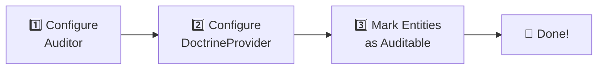

# Quick Start Guide

> **Set up auditing for your Doctrine entities in minutes**

This guide will help you set up auditing for your Doctrine entities in minutes.

## 🔍 Overview

Setting up auditor involves three main steps:



1. **Configure the Auditor** - Set up global options
2. **Configure the DoctrineProvider** - Define which entities to audit
3. **Mark entities as auditable** - Use attributes or configuration

## 1️⃣ Step 1: Create the Auditor

```php
<?php

use DH\Auditor\Auditor;
use DH\Auditor\Configuration;
use Symfony\Component\EventDispatcher\EventDispatcher;

// Create the event dispatcher
$eventDispatcher = new EventDispatcher();

// Create the auditor configuration
$configuration = new Configuration([
    'enabled' => true,
    'timezone' => 'UTC',
    'user_provider' => null,      // Optional: callable to get current user
    'security_provider' => null,  // Optional: callable for security context
    'role_checker' => null,       // Optional: callable to check viewing permissions
]);

// Create the Auditor instance
$auditor = new Auditor($configuration, $eventDispatcher);
```

## 2️⃣ Step 2: Configure the DoctrineProvider

```php
<?php

use DH\Auditor\Provider\Doctrine\Configuration as DoctrineConfiguration;
use DH\Auditor\Provider\Doctrine\DoctrineProvider;
use DH\Auditor\Provider\Doctrine\Service\AuditingService;
use DH\Auditor\Provider\Doctrine\Service\StorageService;

// Create provider configuration
$providerConfiguration = new DoctrineConfiguration([
    'table_prefix' => '',
    'table_suffix' => '_audit',
    'ignored_columns' => [],       // Columns to ignore globally
    'entities' => [
        // Entities configuration (alternative to attributes)
        App\Entity\User::class => [
            'enabled' => true,
            'ignored_columns' => ['password'],  // Entity-specific ignored columns
        ],
        App\Entity\Post::class => [
            'enabled' => true,
        ],
    ],
]);

// Create the DoctrineProvider
$provider = new DoctrineProvider($providerConfiguration);

// Register auditing and storage services
// (typically you use the same EntityManager for both)
$auditingService = new AuditingService('default', $entityManager);
$storageService = new StorageService('default', $entityManager);

$provider->registerAuditingService($auditingService);
$provider->registerStorageService($storageService);

// Register the provider with the Auditor
$auditor->registerProvider($provider);
```

## 3️⃣ Step 3: Mark Entities as Auditable

### Using PHP Attributes (Recommended)

```php
<?php

namespace App\Entity;

use DH\Auditor\Provider\Doctrine\Auditing\Annotation\Auditable;
use DH\Auditor\Provider\Doctrine\Auditing\Annotation\Ignore;
use DH\Auditor\Provider\Doctrine\Auditing\Annotation\Security;
use Doctrine\ORM\Mapping as ORM;

#[ORM\Entity]
#[Auditable]
#[Security(view: ['ROLE_ADMIN'])]  // Optional: restrict who can view audits
class User
{
    #[ORM\Id]
    #[ORM\GeneratedValue]
    #[ORM\Column]
    private ?int $id = null;

    #[ORM\Column(length: 255)]
    private string $email;

    #[ORM\Column(length: 255)]
    #[Ignore]  // This field won't be audited
    private string $password;

    #[ORM\Column(length: 100)]
    private string $name;

    // ... getters and setters
}
```

### Available Attributes

| Attribute    | Target   | Purpose                                    |
|--------------|----------|--------------------------------------------|
| `#[Auditable]` | Class    | Marks an entity as auditable             |
| `#[Ignore]`    | Property | Excludes a field from audit tracking     |
| `#[Security]`  | Class    | Defines roles allowed to view audits     |

## 4️⃣ Step 4: Create Audit Tables

> [!IMPORTANT]
> Before auditing can work, you need to create the audit tables in your database.

```bash
# Using the provided command (with auditor-bundle)
php bin/console audit:schema:update --force

# Or programmatically
$schemaManager = new SchemaManager($provider);
$schemaManager->updateAuditSchema();
```

## 5️⃣ Step 5: Start Auditing

Once configured, the library automatically tracks changes when you persist entities:

> [!NOTE]
> Audit entries are created automatically on `EntityManager::flush()`.

```php
<?php

// Create a new user
$user = new User();
$user->setEmail('john@example.com');
$user->setName('John Doe');

$entityManager->persist($user);
$entityManager->flush();  // ← Audit entry is created here

// Update the user
$user->setName('Jane Doe');
$entityManager->flush();  // ← Update audit entry is created

// Delete the user
$entityManager->remove($user);
$entityManager->flush();  // ← Delete audit entry is created
```

## 📖 Reading Audit Logs

Use the `Reader` class to query audit entries:

```php
<?php

use DH\Auditor\Provider\Doctrine\Persistence\Reader\Reader;

$reader = new Reader($provider);

// Get all audits for the User entity
$query = $reader->createQuery(User::class);
$audits = $query->execute();

// Get audits for a specific user ID
$query = $reader->createQuery(User::class, [
    'object_id' => 123,
]);
$audits = $query->execute();

// Get audits with pagination
$query = $reader->createQuery(User::class, [
    'page' => 1,
    'page_size' => 20,
]);
$result = $reader->paginate($query);
```

---

## What's Next?

- ⚙️ [Configuration Reference](../configuration/index.md) - Detailed configuration options
- 🏷️ [Attributes Reference](../providers/doctrine/attributes.md) - Complete attributes documentation
- 🔍 [Querying Audits](../querying/index.md) - Advanced query techniques
- 👤 [User Attribution](../configuration/user-provider.md) - Track who made changes
