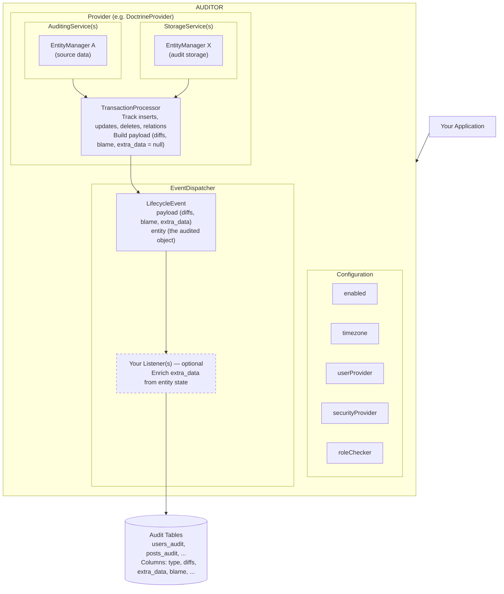

# auditor

> **The missing audit log library for PHP**

## What is auditor?

**auditor** is a PHP library that provides an easy and standardized way to collect audit logs. It is designed to track changes made to your entities and persist them as audit trails.

### Key Features

- 📝 **Automatic change tracking** — Captures inserts, updates, and deletes automatically
- 👤 **User attribution** — Records who made the changes and their IP address
- 🎯 **Flexible configuration** — Choose which entities and fields to audit
- 🔐 **Security controls** — Define who can view audit logs
- 🔌 **Provider-based architecture** — Storage and query layer are fully delegated to providers

## Architecture Overview

The library is architected around two core concepts:

1. **Auditing Services** — Responsible for collecting audit events when changes occur
2. **Storage Services** — Responsible for persisting audit traces to the database

These services are implemented by **Providers**. Each provider handles a specific storage
technology (Doctrine ORM, Eloquent, etc.).

```mermaid
flowchart TD
    APP["Your Application"] --> AUDITOR

    subgraph AUDITOR["AUDITOR"]
        direction TB

        subgraph CONFIG["Configuration"]
            direction LR
            enabled
            timezone
            userProvider
            securityProvider
            roleChecker
        end

        subgraph PROVIDER["Provider (e.g. DoctrineProvider)"]
            direction TB

            subgraph AUDITING["AuditingService(s)"]
                EMA["EntityManager A
                (source data)"]
            end

            subgraph STORAGE["StorageService(s)"]
                EMX["EntityManager X
                (audit storage)"]
            end

            AUDITING --> TP
            STORAGE --> TP

            TP["TransactionProcessor
            Track inserts, updates, deletes, relations
            Build payload (diffs, blame, extra_data = null)"]
        end

        subgraph EVENTS["EventDispatcher"]
            direction TB
            TP --> LE

            LE["LifecycleEvent
            payload (diffs, blame, extra_data)
            entity (the audited object)"]

            LE --> LISTENER

            LISTENER["Your Listener(s) — optional
            Enrich extra_data from entity state"]:::optional
        end
    end

    LISTENER --> DB

    DB[("Audit Tables
    users_audit, posts_audit, ...
    Columns: type, diffs, extra_data, blame, ...")]

    classDef optional stroke-dasharray: 5 5
```

### Data Flow

1. **Entity Change** → Your application modifies an entity via Doctrine
2. **Detection** → `AuditingService` detects the change through Doctrine events
3. **Processing** → `TransactionProcessor` computes diffs and prepares audit data (with `extra_data = null`)
4. **Event** → A `LifecycleEvent` is dispatched with the audit payload and the entity object
5. **Enrichment** *(optional)* → Your listener(s) inspect the entity and populate `extra_data` in the payload
6. **Persistence** → `StorageService` persists the audit entry to the database

## Available Providers

| Provider | Package | Storage technology |
|----------|---------|-------------------|
| DoctrineProvider | [auditor-doctrine-provider](https://damienharper.github.io/auditor-docs/auditor-doctrine-provider/) | Doctrine ORM / DBAL |

## Database Support

Database support depends on the provider used. Via **DoctrineProvider**:

| Database   | Support Level |
|------------|---------------|
| MySQL      | ✅ Full       |
| MariaDB    | ✅ Full       |
| PostgreSQL | ✅ Full       |
| SQLite     | ✅ Full       |

> [!NOTE]
> DoctrineProvider should work with any database supported by Doctrine DBAL, though only the above are actively tested.

## Version Compatibility

| Version | Status                     | Requirements                                                          |
|---------|----------------------------|-----------------------------------------------------------------------|
| 4.x     | Active development 🚀      | PHP >= 8.4, Symfony >= 8.0 |
| 3.x     | Active support             | PHP >= 8.2, Symfony >= 5.4                                            |
| 2.x     | End of Life                | PHP >= 7.4, Symfony >= 4.4                                            |
| 1.x     | End of Life                | PHP >= 7.2, Symfony >= 3.4                                            |

## Quick Links

- [Installation Guide](getting-started/installation.md)
- [Quick Start](getting-started/quick-start.md)
- [Configuration Reference](configuration/index.md)
- [DoctrineProvider](providers/doctrine/index.md)
- [Querying Audits](querying/index.md)
- [Extra Data](extra-data.md)
- [API Reference](api/index.md)

## Related Projects

- **[auditor-bundle](https://github.com/DamienHarper/auditor-bundle)** - Symfony bundle for seamless integration

## License

This library is released under the [MIT License](https://opensource.org/licenses/MIT).
