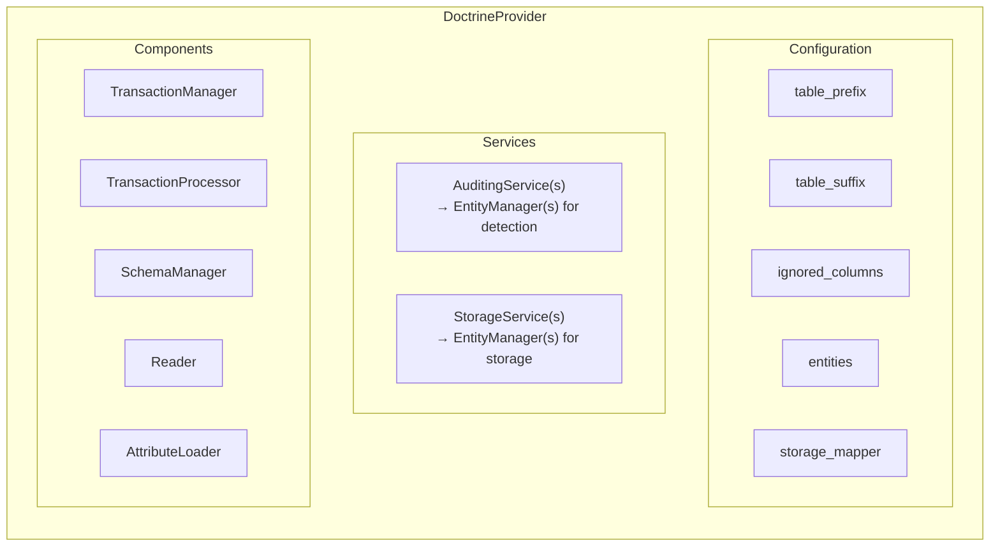

# DoctrineProvider

> **The default provider for auditing Doctrine ORM entities**

The `DoctrineProvider` is the default and primary provider shipped with auditor. It provides both **auditing** and **storage** capabilities for Doctrine ORM entities.

## 🔍 Overview

The DoctrineProvider:

- 📝 **Tracks entity changes** - Inserts, updates, and deletes
- 🔗 **Tracks relationships** - Many-to-many associations and dissociations
- 💾 **Persists audit logs** - Stores audits in dedicated audit tables
- 🔄 **Transactional integrity** - Audit entries are part of the same transaction as your changes

## ✨ Key Features

### Automatic Change Detection

The provider hooks into Doctrine's event system to automatically detect:

- **Insertions** - New entities being persisted
- **Updates** - Changes to existing entities with full diff
- **Deletions** - Entities being removed
- **Associations** - Relationships being created
- **Dissociations** - Relationships being removed

### Audit Table Structure

For each audited entity, a corresponding audit table is created:

| Column                | Type          | Description                            |
|-----------------------|---------------|----------------------------------------|
| `id`                  | `integer`     | Auto-increment primary key             |
| `type`                | `string(10)`  | Action type (insert/update/remove/etc) |
| `object_id`           | `string(255)` | ID of the audited entity               |
| `discriminator`       | `string(255)` | Entity class (for inheritance)         |
| `transaction_hash`    | `string(40)`  | Hash grouping related changes          |
| `diffs`               | `json/text`   | The actual changes (JSON)              |
| `blame_id`            | `string(255)` | User identifier                        |
| `blame_user`          | `string(255)` | Username                               |
| `blame_user_fqdn`     | `string(255)` | User class name                        |
| `blame_user_firewall` | `string(100)` | Firewall name                          |
| `ip`                  | `string(45)`  | Client IP address                      |
| `created_at`          | `datetime`    | When the audit was created             |

### Action Types

| Type          | Description                                    |
|---------------|------------------------------------------------|
| `insert`      | A new entity was created                       |
| `update`      | An existing entity was modified                |
| `remove`      | An entity was deleted                          |
| `associate`   | A many-to-many relationship was created        |
| `dissociate`  | A many-to-many relationship was removed        |

## 🏗️ Architecture



## 🗄️ Supported Databases

| Database   | Support | Notes                               |
|------------|---------|-------------------------------------|
| MySQL      | ✅       | Full support with JSON column type  |
| MariaDB    | ✅       | Full support with JSON column type  |
| PostgreSQL | ✅       | Full support with JSON column type  |
| SQLite     | ✅       | JSON stored as TEXT                 |

## ⚠️ Limitations

> [!CAUTION]
> Important limitations to be aware of:

1. **Composite primary keys are not supported**
2. **DQL/SQL direct queries are not tracked** - Only changes through EntityManager
3. **Bulk operations are not tracked** - Use `EntityManager::flush()` after each entity

## 📚 Sections

- [Configuration](configuration.md) - Configure the DoctrineProvider
- [Attributes](attributes.md) - Mark entities and fields for auditing
- [Services](services.md) - Auditing and storage services
- [Schema Management](schema.md) - Audit table management
- [Multi-Database](multi-database.md) - Store audits in separate databases

## 🚀 Basic Usage

```php
<?php

use DH\Auditor\Provider\Doctrine\Configuration;
use DH\Auditor\Provider\Doctrine\DoctrineProvider;
use DH\Auditor\Provider\Doctrine\Service\AuditingService;
use DH\Auditor\Provider\Doctrine\Service\StorageService;

// Create configuration
$configuration = new Configuration([
    'table_suffix' => '_audit',
    'entities' => [
        App\Entity\User::class => ['enabled' => true],
        App\Entity\Post::class => ['enabled' => true],
    ],
]);

// Create provider
$provider = new DoctrineProvider($configuration);

// Register services
$provider->registerAuditingService(new AuditingService('default', $entityManager));
$provider->registerStorageService(new StorageService('default', $entityManager));

// Register with auditor
$auditor->registerProvider($provider);
```

---

## Next Steps

- ⚙️ [Configuration Reference](configuration.md)
- 🏷️ [Attributes Reference](attributes.md)
- 🔍 [Querying Audits](../../querying/index.md)
