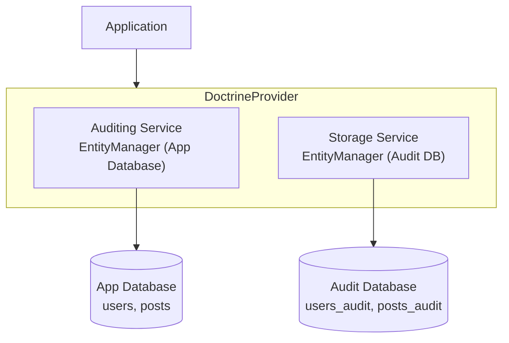

# Multi-Database Configuration

> **Store audit logs in a separate database from your application data**

This guide explains how to store audit logs in a separate database from your application data.

## 🎯 Use Cases

Storing audits in a separate database can be beneficial for:

- **Performance** - Audit writes don't compete with application queries
- **Compliance** - Separate storage for regulatory requirements
- **Security** - Different access controls for audit data
- **Scalability** - Independent scaling of audit storage
- **Retention** - Different backup/retention policies

## 🏗️ Architecture Overview



## 🚀 Basic Setup

### 1. Configure Database Connections

In your Symfony configuration:

```yaml
# config/packages/doctrine.yaml
doctrine:
    dbal:
        default_connection: default
        connections:
            default:
                url: '%env(DATABASE_URL)%'
            audit:
                url: '%env(AUDIT_DATABASE_URL)%'

    orm:
        default_entity_manager: default
        entity_managers:
            default:
                connection: default
                mappings:
                    App:
                        is_bundle: false
                        dir: '%kernel.project_dir%/src/Entity'
                        prefix: 'App\Entity'
                        alias: App
            
            audit:
                connection: audit
                # No entity mappings - only stores audit tables
```

### 2. Configure the Provider

```php
<?php

use DH\Auditor\Provider\Doctrine\Configuration;
use DH\Auditor\Provider\Doctrine\DoctrineProvider;
use DH\Auditor\Provider\Doctrine\Service\AuditingService;
use DH\Auditor\Provider\Doctrine\Service\StorageService;

// Create provider configuration
$configuration = new Configuration([
    'table_suffix' => '_audit',
]);

$provider = new DoctrineProvider($configuration);

// Auditing service watches the application EntityManager
$provider->registerAuditingService(
    new AuditingService('default', $appEntityManager)
);

// Storage service uses the dedicated audit EntityManager
$provider->registerStorageService(
    new StorageService('audit', $auditEntityManager)
);
```

## 🔀 Multiple Source Databases

If you have multiple application databases:

```php
<?php

$provider = new DoctrineProvider(new Configuration([
    'table_suffix' => '_audit',
]));

// Watch multiple application databases
$provider->registerAuditingService(
    new AuditingService('app', $appEntityManager)
);
$provider->registerAuditingService(
    new AuditingService('crm', $crmEntityManager)
);
$provider->registerAuditingService(
    new AuditingService('legacy', $legacyEntityManager)
);

// Single audit storage
$provider->registerStorageService(
    new StorageService('audit', $auditEntityManager)
);
```

## 🗄️ Multiple Storage Databases with Routing

For complex scenarios, use a storage mapper to route audits:

```php
<?php

use DH\Auditor\Provider\Doctrine\Service\StorageService;

$configuration = new Configuration([
    'table_suffix' => '_audit',
    
    'storage_mapper' => function (string $entity, array $storageServices): StorageService {
        // Route based on entity type
        if (str_starts_with($entity, 'App\\Entity\\Financial\\')) {
            return $storageServices['financial_audit'];
        }
        
        if (str_starts_with($entity, 'App\\Entity\\User\\')) {
            return $storageServices['user_audit'];
        }
        
        // Default storage
        return $storageServices['default_audit'];
    },
]);

$provider = new DoctrineProvider($configuration);

// Register auditing services
$provider->registerAuditingService(new AuditingService('app', $appEntityManager));

// Register multiple storage services
$provider->registerStorageService(new StorageService('default_audit', $defaultAuditEM));
$provider->registerStorageService(new StorageService('financial_audit', $financialAuditEM));
$provider->registerStorageService(new StorageService('user_audit', $userAuditEM));
```

## 📍 Storage Mapper Examples

### Route by Entity Class

```php
'storage_mapper' => function (string $entity, array $storageServices): StorageService {
    return match ($entity) {
        User::class, Profile::class => $storageServices['sensitive'],
        Payment::class, Invoice::class => $storageServices['financial'],
        default => $storageServices['default'],
    };
}
```

### Route by Namespace

```php
'storage_mapper' => function (string $entity, array $storageServices): StorageService {
    $namespace = substr($entity, 0, strrpos($entity, '\\'));
    
    return match ($namespace) {
        'App\\Entity\\Admin' => $storageServices['admin_audit'],
        'App\\Entity\\Api' => $storageServices['api_audit'],
        default => $storageServices['default'],
    };
}
```

### Route by Custom Logic

```php
'storage_mapper' => function (string $entity, array $storageServices) use ($sensitiveEntities): StorageService {
    // Check if entity is in the sensitive list
    if (in_array($entity, $sensitiveEntities, true)) {
        return $storageServices['secure'];
    }
    
    // Check for specific interface
    if (is_subclass_of($entity, FinancialEntityInterface::class)) {
        return $storageServices['financial'];
    }
    
    return $storageServices['default'];
}
```

## 🛠️ Schema Management

When using multiple storage databases, the schema manager handles each one:

```bash
# Preview SQL for all storage databases
php bin/console audit:schema:update --dump-sql

# Update all storage databases
php bin/console audit:schema:update --force
```

Or programmatically:

```php
$schemaManager = new SchemaManager($provider);

// Get SQL grouped by storage service
$sqls = $schemaManager->getUpdateAuditSchemaSql();
// Returns: ['storage_name' => ['SQL1', 'SQL2', ...], ...]

// Update all
$schemaManager->updateAuditSchema();
```

## 📖 Reading Audits

When reading audits, the Reader automatically uses the correct storage:

```php
$reader = new Reader($provider);

// This automatically queries the correct audit database
$query = $reader->createQuery(User::class);
$audits = $query->execute();
```

## ⚠️ Transaction Considerations

### Same Transaction (Not Possible)

> [!IMPORTANT]
> When using separate databases, audit entries **cannot** be in the same transaction as entity changes.

This means:

- ✅ Audit entries are written after successful entity changes
- ⚠️ If audit write fails, entity changes are still committed
- ⚠️ No automatic rollback of entity changes on audit failure

### 🛡️ Handling Failures

Consider implementing:

1. **Retry mechanism** for failed audit writes
2. **Fallback storage** (e.g., file-based logging)
3. **Monitoring** for audit write failures

```php
// Example: Custom event listener for audit failures
$dispatcher->addListener(LifecycleEvent::class, function (LifecycleEvent $event) use ($logger) {
    try {
        // Audit write happens here...
    } catch (\Exception $e) {
        $logger->critical('Audit write failed', [
            'entity' => $event->getPayload()['entity'],
            'error' => $e->getMessage(),
        ]);
        
        // Write to fallback storage
        $this->fallbackStorage->store($event->getPayload());
    }
});
```

## 📝 Configuration Summary

```php
<?php

use DH\Auditor\Auditor;
use DH\Auditor\Configuration as AuditorConfiguration;
use DH\Auditor\Provider\Doctrine\Configuration as DoctrineConfiguration;
use DH\Auditor\Provider\Doctrine\DoctrineProvider;
use DH\Auditor\Provider\Doctrine\Service\AuditingService;
use DH\Auditor\Provider\Doctrine\Service\StorageService;

// Main auditor config
$auditorConfig = new AuditorConfiguration([
    'enabled' => true,
    'timezone' => 'UTC',
]);

$auditor = new Auditor($auditorConfig, $eventDispatcher);

// Provider config with storage mapper
$providerConfig = new DoctrineConfiguration([
    'table_suffix' => '_audit',
    'storage_mapper' => function (string $entity, array $services): StorageService {
        // Your routing logic here
        return $services['default'];
    },
]);

$provider = new DoctrineProvider($providerConfig);

// Register services
$provider->registerAuditingService(new AuditingService('app', $appEM));
$provider->registerStorageService(new StorageService('default', $auditEM));
$provider->registerStorageService(new StorageService('sensitive', $sensitiveAuditEM));

// Register provider
$auditor->registerProvider($provider);
```

## ✅ Best Practices

1. **Use connection pooling** - Multiple databases mean more connections
2. **Monitor both databases** - Ensure audit DB has adequate resources
3. **Separate backups** - Audit data may have different retention needs
4. **Test failover scenarios** - What happens when audit DB is unavailable?
5. **Document your setup** - Complex routing logic should be well-documented

> [!TIP]
> Consider using a message queue (like Symfony Messenger) for audit persistence to improve application response times and handle failures gracefully.

---

## Related

- ⚙️ [Services Reference](services.md)
- 🛠️ [Schema Management](schema.md)
- 📋 [Configuration Reference](configuration.md)
