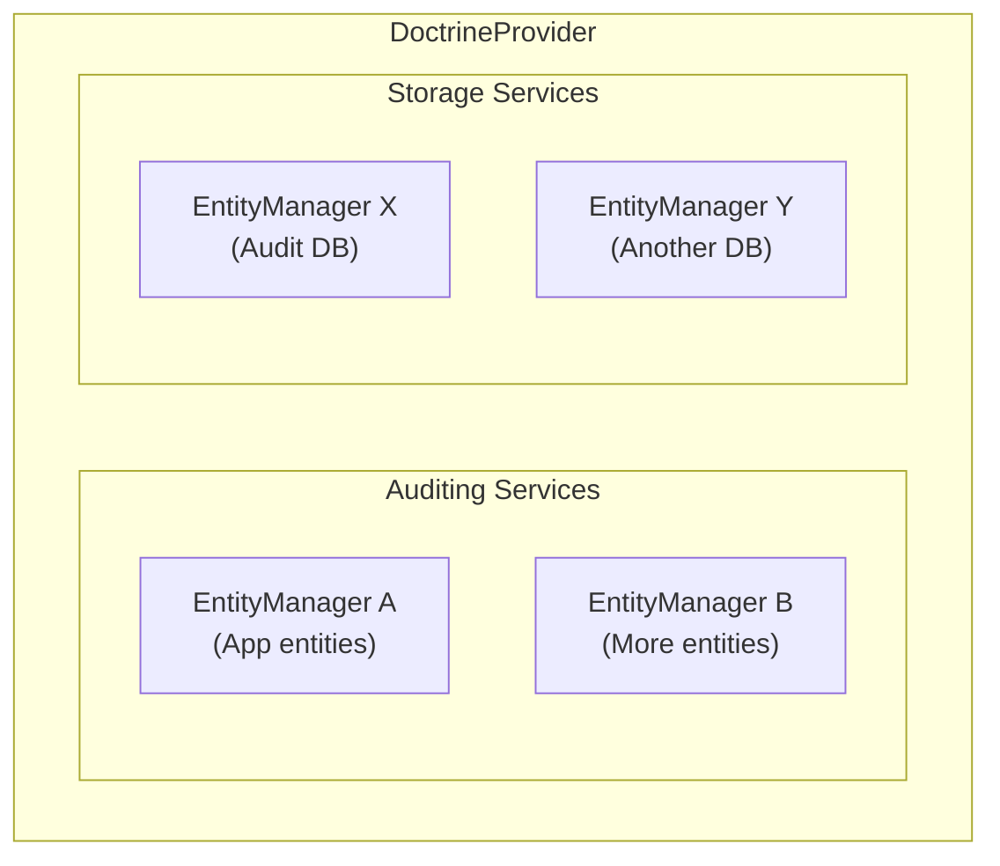

# Auditing and Storage Services

> **Understand how DoctrineProvider detects and persists audit logs**

The DoctrineProvider uses two types of services: **Auditing Services** for detecting changes and **Storage Services** for persisting audit logs.

## 🔍 Overview



## 📝 Auditing Service

The `AuditingService` wraps a Doctrine EntityManager and is responsible for:

- Listening to entity changes (via Doctrine events)
- Collecting change data (inserts, updates, deletes, associations)
- Passing changes to the storage layer

### Creating an Auditing Service

```php
<?php

use DH\Auditor\Provider\Doctrine\Service\AuditingService;

$auditingService = new AuditingService(
    'default',      // Service name (unique identifier)
    $entityManager  // The EntityManager to watch
);
```

### Registering with the Provider

```php
$provider->registerAuditingService($auditingService);
```

## 💾 Storage Service

The `StorageService` wraps a Doctrine EntityManager and is responsible for:

- Storing audit entries in the database
- Managing audit table schemas

### Creating a Storage Service

```php
<?php

use DH\Auditor\Provider\Doctrine\Service\StorageService;

$storageService = new StorageService(
    'default',      // Service name (unique identifier)
    $entityManager  // The EntityManager for audit storage
);
```

### Registering with the Provider

```php
$provider->registerStorageService($storageService);
```

## 🏠 Common Setup: Single Database

Most applications store audits in the same database as the entities:

```php
<?php

use DH\Auditor\Provider\Doctrine\DoctrineProvider;
use DH\Auditor\Provider\Doctrine\Configuration;
use DH\Auditor\Provider\Doctrine\Service\AuditingService;
use DH\Auditor\Provider\Doctrine\Service\StorageService;

// Create provider
$provider = new DoctrineProvider(new Configuration([
    'table_suffix' => '_audit',
]));

// Use the same EntityManager for both
$provider->registerAuditingService(new AuditingService('default', $entityManager));
$provider->registerStorageService(new StorageService('default', $entityManager));
```

## 🗄️ Multi-Database Setup

> [!TIP]
> For performance or compliance reasons, you might want to store audits in a separate database.

### Separate Audit Database

```php
<?php

// Main application EntityManager
$appEntityManager = $this->getDoctrine()->getManager('default');

// Dedicated audit database EntityManager
$auditEntityManager = $this->getDoctrine()->getManager('audit');

$provider = new DoctrineProvider(new Configuration([
    'table_suffix' => '_audit',
]));

// Watch entities in the main database
$provider->registerAuditingService(new AuditingService('default', $appEntityManager));

// Store audits in the audit database
$provider->registerStorageService(new StorageService('audit', $auditEntityManager));
```

### Multiple Databases with Router

When you have multiple EntityManagers and want to route audits dynamically:

```php
<?php

$provider = new DoctrineProvider(new Configuration([
    'table_suffix' => '_audit',
    'storage_mapper' => function (string $entity, array $storageServices) {
        // Route based on entity namespace
        if (str_starts_with($entity, 'App\\Entity\\Core\\')) {
            return $storageServices['core_audit'];
        }
        if (str_starts_with($entity, 'App\\Entity\\Finance\\')) {
            return $storageServices['finance_audit'];
        }
        return $storageServices['default'];
    },
]));

// Register auditing services (where changes are detected)
$provider->registerAuditingService(new AuditingService('core', $coreEntityManager));
$provider->registerAuditingService(new AuditingService('finance', $financeEntityManager));

// Register storage services (where audits are stored)
$provider->registerStorageService(new StorageService('default', $defaultAuditEntityManager));
$provider->registerStorageService(new StorageService('core_audit', $coreAuditEntityManager));
$provider->registerStorageService(new StorageService('finance_audit', $financeAuditEntityManager));
```

See [Multi-Database Configuration](multi-database.md) for more details.

## 🔍 Getting Services from Provider

### Get All Auditing Services

```php
$auditingServices = $provider->getAuditingServices();
// Returns: ['service_name' => AuditingService, ...]
```

### Get All Storage Services

```php
$storageServices = $provider->getStorageServices();
// Returns: ['service_name' => StorageService, ...]
```

### Get Service for Specific Entity

```php
// Get the auditing service that manages this entity
$auditingService = $provider->getAuditingServiceForEntity(User::class);

// Get the storage service where this entity's audits are stored
$storageService = $provider->getStorageServiceForEntity(User::class);
```

## 📛 Service Names

> [!IMPORTANT]
> Service names must be unique within their type (auditing or storage).

They're used for:

- Identifying services in logs and debugging
- Mapping entities to storage services
- Configuration and reference

```php
// Bad: Non-descriptive names
new AuditingService('a', $em);

// Good: Descriptive names
new AuditingService('app_default', $appEm);
new AuditingService('legacy_crm', $crmEm);
new StorageService('primary_audit_storage', $auditEm);
```

## 📦 Base Service Class

Both `AuditingService` and `StorageService` extend `DoctrineService`:

```php
namespace DH\Auditor\Provider\Doctrine\Service;

abstract class DoctrineService extends AbstractService
{
    public function __construct(string $name, EntityManagerInterface $entityManager);
    
    public function getEntityManager(): EntityManagerInterface;
}
```

## ⚠️ Error Handling

### Duplicate Service Names

> [!WARNING]
> Registering services with the same name will throw an exception.

```php
$provider->registerAuditingService(new AuditingService('default', $em1));
$provider->registerAuditingService(new AuditingService('default', $em2));
// Throws: ProviderException - 'An auditing service named "default" is already registered.'
```

### Missing Storage Mapper

> [!CAUTION]
> If you have multiple storage services but no mapper, an exception will be thrown when storing an audit.

```php
// If you have multiple storage services but no mapper
$provider->registerStorageService(new StorageService('storage1', $em1));
$provider->registerStorageService(new StorageService('storage2', $em2));

// And no storage_mapper configured
// When storing an audit:
// Throws: ProviderException - 'You must provide a mapper callback to map audits to storage.'
```

## ✅ Best Practices

1. **Use descriptive service names** - Makes debugging easier
2. **Keep it simple when possible** - Single database is often sufficient
3. **Consider read replicas** - Use replicas for reading audits to reduce load
4. **Test your multi-database setup** - Ensure transactions work correctly
5. **Document your architecture** - Especially with multiple services

---

## Next Steps

- 🗄️ [Multi-Database Configuration](multi-database.md)
- 🛠️ [Schema Management](schema.md)
- 🔍 [Querying Audits](../../querying/index.md)
